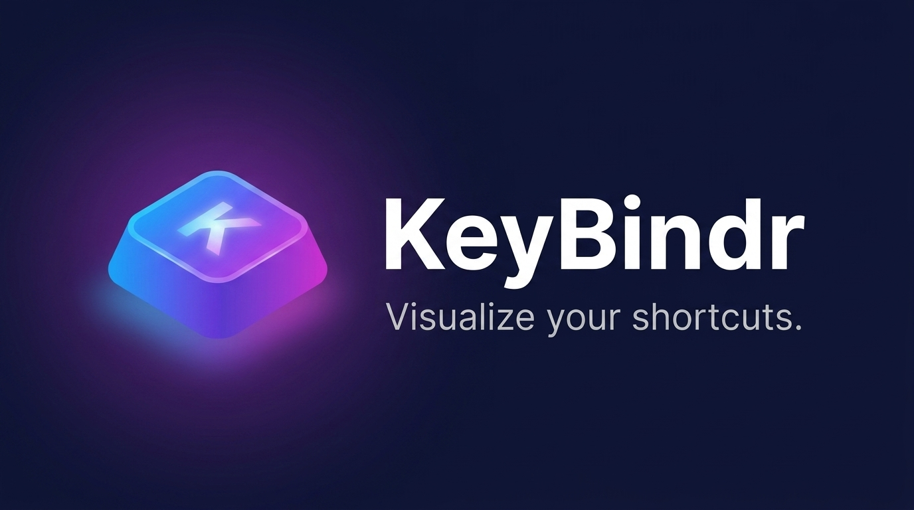

<p align="center">
  
</p>

<p align="center">
  A browser-based interactive tool for visualizing and documenting keyboard shortcuts.<br>
  Click any key on a fully rendered keyboard to assign labels, modifiers, descriptions, and color categories.
</p>

<p align="center">
  <strong>Version:</strong> 0.5.1 — work in progress, active development.
</p>

---

## Features

### Keyboard

- **Multiple form factors** — Full (104-key), Tenkeyless (TKL), 60%, Split, ZSA Voyager, ZSA Moonlander, and ErgoDox EZ layouts rendered on the fly
- **Key map support** — switch between QWERTY, Dvorak, Colemak, AZERTY, and QWERTZ; key labels update instantly while physical key IDs and existing assignments are preserved
- **Full 104-key layout** includes main block, navigation cluster, and numpad rendered from structured JavaScript data — no images or SVG sprites

### Key assignment

- **Click any key** to open an edit popover and assign:
  - Modifier keys (Ctrl, Alt, Shift, Win)
  - Action label (e.g. "Undo", "Save", "Jump")
  - Optional description
  - Color category
- **Fully custom categories** — blank maps start with no categories; create any category with a name and color picker; edit or delete categories inline; templates auto-populate only the categories they use; categories persist to `localStorage`
- **Modifier pills** and action labels displayed directly on assigned key faces, filled with the category color

### Templates & map management

- **Built-in templates** — load a ready-made hotkey map for Adobe Photoshop, Adobe Premiere Pro, Battlefield 6, Counter-Strike 2, VS Code, or World of Warcraft via the Templates button (sorted alphabetically); each tile shows the app's official product icon; template list is sorted alphabetically
- **Multi-tab templates** — templates can define multiple context tabs (e.g. Battlefield 6 ships with 7 tabs: Infantry, Ground Vehicle, Aircraft, etc.); loading a multi-tab template replaces all existing tabs
- **New Map** — clicking "New" opens a confirmation dialog; on confirm, all hotkeys, categories, and tabs are cleared and the map name is set to "New Map"
- **Category filter tabs** — filter the template grid by Design, Video, Gaming, or Development
- Same JSON shape as Export/Import — any exported map can become a template

### Visualization & interaction

- **Hover tooltips** — hovering any assigned key shows a floating tooltip with the action label, modifiers, description, and category
- **Category hover highlight** — hovering a category chip dims all non-matching keys and fades other summary groups; clicking locks the filter with a ✓ indicator; click again to clear
- **Heat map mode** — toggle in the layout bar; colors every key by proximity density to assigned keys, from cool (sparse) to warm (dense clusters)
- **Hover cross-highlight** — hovering an assigned key highlights its summary row, and vice versa

### UI & theming

- **Collapsible categories bar** — toggle button in the categories header collapses the chip list with a smooth animation; when collapsed, any active (filtered) category chip remains visible; state persists across sessions
- **Click-to-edit from summary** — clicking any row in the Hotkey Summary opens the edit popover pre-filled for that key; a pencil icon appears on hover as a visual affordance
- **Responsive scaling** — keyboard scales dynamically to fit any viewport via `ResizeObserver` and `transform: scale()`; visual corner radius compensated inversely so rounded corners look consistent at any zoom level; header collapses to a hamburger menu on narrow screens (≤768 px); a tablet breakpoint (≤1024 px) trims the layout bar to Templates + Form Factor + Key Map to avoid crowding; categories and summary reflow for single-column display
- **Style dropdown** — "Style" button in the header nav opens a panel with two sections: Color Scheme (five full UI themes: Default, Synthwave, Phosphor, Crimson, Forge) and Mode (Light / System / Dark); each scheme has independent dark and light variants with per-scheme aurora background and key hover glow; preferences persist under `keybindr-scheme` and `keybindr-theme`
- **Windows / Mac platform toggle** — Win / Mac segmented control in the header nav left side; switches modifier labels throughout the UI (`Ctrl → Cmd`, `Alt → Opt`) in summary chips, key tooltips, and copy output; persists across sessions
- **Chakra Petch font** — UI uses Chakra Petch (Google Fonts) for a technical, game-UI character across all platforms
- **Category legend** above the keyboard with per-category key counts and total coverage (`X / Y keys assigned`)
- **Hotkey summary panel** below the keyboard — all assigned hotkeys grouped by category in 4 draggable columns; searchable by label or description; each category group shows an item count badge and a collapse/expand chevron; collapsed state persists across sessions
- **Drag-to-reorder** — drag category groups in the summary to reorder within or across columns; arrangement persists; drop indicators appear only when hovering over a category header (top half = insert before, bottom half = insert after), preventing false positives over item lists; a 40 px drop zone below each column's last group allows appending without needing to target a header; in overflow mode, drag updates the category sequence without disabling overflow; dragging an overflowing category highlights the nearest valid drop target even when the cursor stays within the category's own columns
- **Summary Settings** — gear icon in the top-right corner of the summary card opens a settings popup; includes a column overflow toggle (off by default) that splits large categories across consecutive adjacent columns at a configurable threshold (default 8 items), with remaining categories auto-balancing into available space

### Context tabs

- **Per-map tabs** — create multiple named tabs within a single map for situational hotkey sets (e.g. On Foot, Driving, Flying, Menu); each tab holds its own independent hotkey assignments; always starts with a Default tab
- **Tab switching** — clicking a tab saves the current tab's hotkeys and loads the selected tab's, re-rendering the keyboard and summary instantly
- **Add tabs** — "+" button opens an in-app naming dialog; tab names up to 30 characters
- **Rename tabs** — double-click any tab name to rename it via an in-app dialog pre-filled with the current name
- **Delete tabs** — open the rename dialog and click "Delete Tab"; a confirmation prompt warns before removing the tab and all its hotkeys; the last remaining tab cannot be deleted
- **Reorder tabs** — drag any tab left or right; an accent-color drop indicator shows the insertion point; order persists to `localStorage`

### Data & export

- **Named maps** — editable map name in the layout bar
- **New / Clear** — "New" opens a confirm dialog that wipes hotkeys, categories, and tabs and sets the map name to "New Map"; "Clear ▾" opens a dropdown with toggle switches for Hotkeys, Categories, and Tabs — enable any combination and click Clear to selectively wipe
- **Export / Import** — save any map as a `.json` file and reload it later; exported JSON includes map name, generation date, and KeyBindr source attribution
- **Share panel** — "Share" button opens a dropdown with nine options: Copy Link (shareable URL with map encoded in the hash), Copy Text (plain-text summary), Copy as Markdown (rich-text clipboard with `text/html` + `text/plain` for Notion/Docs compatibility), Post on X, Share on Reddit, Share via Email, Export JSON, Export PNG, and Print; all outputs include the map name, date, and a KeyBindr backlink
- **Export PNG** — captures the full app view (categories bar, active summary tab, keyboard) as a high-resolution PNG (2× pixel ratio) using `html-to-image`; filename is `{map-name}-{YYYY-MM-DD}.png`; collapsed categories bar is temporarily expanded for the capture
- **Undo / Redo** — Ctrl+Z / Ctrl+Shift+Z (or layout bar buttons) with a 50-entry history
- **Key conflict detection** — warning in the edit popover when a label is already used on another key
- **Label autocomplete** — typeahead dropdown on the Action Label field showing matching labels from existing assignments
- **Print** — clean printable layout; UI chrome hidden via `@media print`
- **Persistent** — all assignments, map name, layout, key map, summary arrangement, and custom categories saved to `localStorage`

### Analytics

- **Google Analytics 4** — comprehensive event tracking via GA4 custom events, including key assignments, exports, imports, template loads, shares, prints, layout/keymap/theme changes, undo/redo, heatmap toggles, and more
- **Session counters** — exports, imports, saves, shares, and prints each carry a `session_count` parameter so GA4 can report how many times each action is taken per visit
- **Returning user detection** — fires `returning_user` on page load when a saved map exists in `localStorage`; fires `map_loaded_from_url` when a shared URL is opened

---

## How It Works

The keyboard is rendered entirely at runtime from layout data arrays (`MAIN_ROWS`, `NAV_ROWS`, `NUMPAD_KEYS`, `ZSA_KEYBOARDS`) in `app.js`. Switching form factor or key map re-renders the keyboard without touching stored hotkey data.

The numpad uses CSS Grid with explicit `grid-column` / `grid-row` placement to handle special-shaped keys (`+` and `Enter` span 2 rows, `0` spans 2 columns). ZSA split keyboards use a column-stagger renderer with computed thumb cluster offsets.

App state:

```js
{
  hotkeys:          { [keyId]: { label, description, category, modifiers[] } },
  layout:           'full' | 'tkl' | '60' | 'split' | 'voyager' | 'moonlander' | 'ergodox',
  keyMap:           'qwerty' | 'dvorak' | 'colemak' | 'azerty' | 'qwertz',
  summaryCols:      [ [catId, ...], [catId, ...], [catId, ...], [catId, ...] ],
  categories:       [ { id, name, color } ],
  platform:         'windows' | 'mac',
  collapsedCats:    Set<catId>,
  summarySettings:  { overflow: boolean, overflowAt: number, catOrder: string[] },
  tabs:             [ { id, name, hotkeys: {} } ],
  activeTabId:      string
}
```

Theme preference, color scheme, and categories-bar collapsed state are stored separately under `keybindr-theme`, `keybindr-scheme`, and `keybindr-legend-collapsed`.

---

## Running Locally

No build step required. Serve the `site/` directory with any static file server:

```bash
# Option A — npx serve (recommended)
npx serve site --listen 3000

# Option B — Python
python -m http.server 8080 --directory site
```

Then open `http://localhost:3000` (or `:8080`).

---

## Project Structure

```
site/
├── index.html          # App shell — header, layout bar, keyboard, legend, summary, popovers
├── style.css           # Themed stylesheet using CSS custom properties (light + dark)
├── app.js              # All layout data, key maps, and application logic
├── analytics.js        # Google Analytics 4 gtag() initialization (extracted from index.html for CSP)
├── templates.js        # Built-in template maps (loaded before app.js)
├── _headers            # Cloudflare Pages headers — sitemap MIME type, HSTS, CSP, security headers
├── package.json        # Metadata only — no dependencies, no build tools
├── logos/              # Brand assets (app icon, square logo, wide banner)
├── favicon.svg
├── favicon-96x96.png
├── favicon.ico
├── apple-touch-icon.png
├── site.webmanifest
├── og-image.png        # 1200×630 Open Graph image for social sharing
└── CHANGELOG.md
```

---

## Tech Stack

- Vanilla HTML / CSS / JavaScript — no framework, no build tools, no dependencies
- Runs entirely in the browser; no server-side logic

---

## Planned

- More built-in templates (community apps, additional games)
- Modifier layer views (Base / Shift / Ctrl / Alt layers per key)
- Export to cloud storage (local file picker + cloud-synced folder)

---

## License

MIT
<!-- deploy -->
